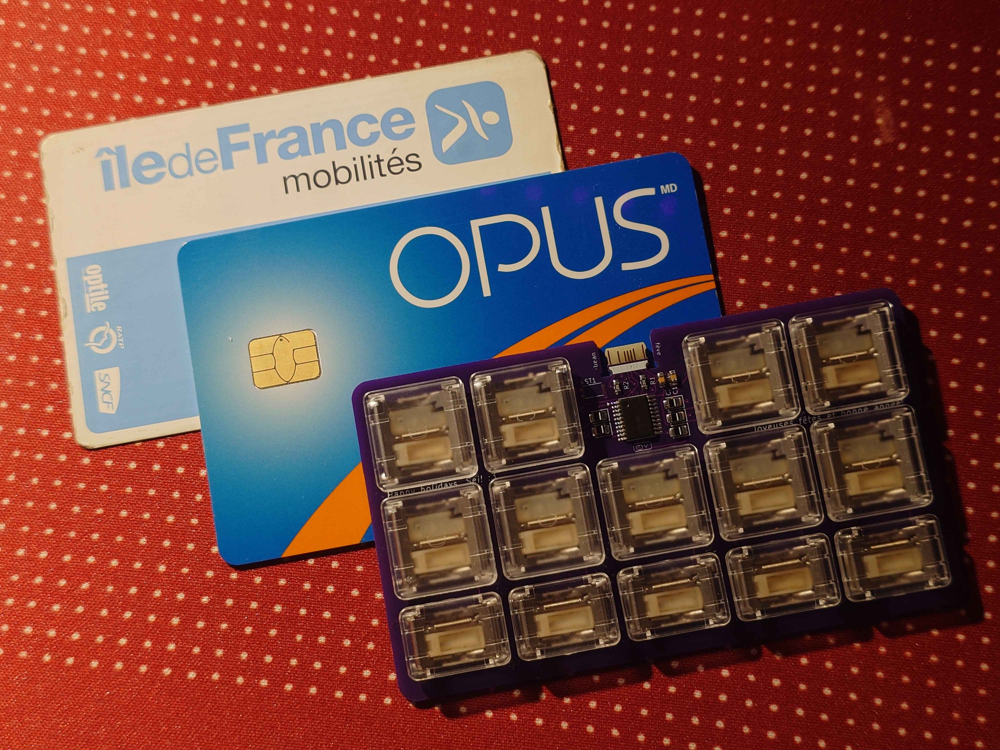

# Secret Santa 2025 : Sei
This repo holds all the files for my secret santa gift, *La Carte Blanche*; a card-sized 14-key keyboard with PG1316S and M switches running FAK on a CH552T.

## PCB
All the PCB files and [gerbers](pcb/secret-santa-2025/jlcpcb/gerber/) are available; the PCB can be assembled with 14 0805 1N4148 diodes, 2 0605 100nF capacitors, 2 0605 5.1K resistors and a CH55T. You will need 9 PG1316S and 5 PG1316M switches.
For the min-spec USB-C connector, I recommend having the PCB made with ENIG plating to increase durability. It will need to be 0.8mm thick (0.6mm works too but would be a little loose). 
The reset button is available [here](https://www.lcsc.com/product-detail/C963197.html) from LCSC.

## Firmware
Put the [carte-blanche](firmware/carte-blanche/) folder into the keyboards folder of your fak-config and compile.  The [.ihx](firmware/carte-blanche.ihx) is also included if you would like to test your PCB; the base layout is alphabetical from left to right, top down.

## Credits and Licensing
Credit to [AnasMalas](https://github.com/AnasMalas/pcb-edge-usb-c) for the min-spec USB-C connector. The silk was drawn by me with technical drawings created from STEP files made available by Kailh.
The USB-C connector is under a CC-1.0 licence, and the project proper is under the [CERN-OHL-S-2.0 licence](LICENSE).
